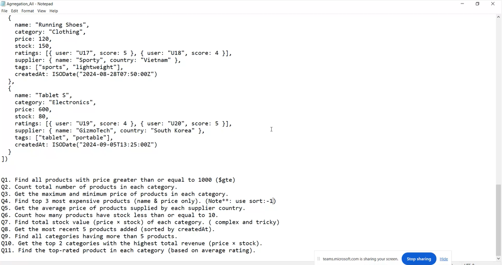

# insert 
`db.products.insertMany([
  {
    name: "Running Shoes",
    category: "Clothing",
    price: 120,
    stock: 150,
    ratings: [{ user: "U17", score: 5 }, { user: "U18", score: 4 }],
    supplier: { name: "Sporty", country: "Vietnam" },
    tags: ["sports", "lightweight"],
    createdAt: ISODate("2024-08-28T07:50:00Z")
  },
  {
    name: "Tablet S",
    category: "Electronics",
    price: 600,
    stock: 80,
    ratings: [{ user: "U19", score: 4 }, { user: "U20", score: 5 }],
    supplier: { name: "GizmoTech", country: "South Korea" },
    tags: ["tablet", "portable"],
    createdAt: ISODate("2024-09-05T13:25:00Z")
  },
  {
    name: "Winter Jacket",
    category: "Clothing",
    price: 250,
    stock: 60,
    ratings: [{ user: "U21", score: 3 }, { user: "U22", score: 4 }],
    supplier: { name: "CozyWear", country: "Canada" },
    tags: ["winter", "warm"],
    createdAt: ISODate("2024-10-10T08:00:00Z")
  },
  {
    name: "Smartphone X",
    category: "Electronics",
    price: 1200,
    stock: 40,
    ratings: [{ user: "U23", score: 5 }, { user: "U24", score: 5 }],
    supplier: { name: "GizmoTech", country: "South Korea" },
    tags: ["phone", "smart"],
    createdAt: ISODate("2024-09-15T09:30:00Z")
  },
  {
    name: "Office Chair",
    category: "Furniture",
    price: 180,
    stock: 30,
    ratings: [{ user: "U25", score: 4 }],
    supplier: { name: "FurniCo", country: "USA" },
    tags: ["office", "comfort"],
    createdAt: ISODate("2024-07-20T11:20:00Z")
  },
  {
    name: "Gaming Laptop",
    category: "Electronics",
    price: 1500,
    stock: 20,
    ratings: [{ user: "U26", score: 5 }, { user: "U27", score: 4 }],
    supplier: { name: "TechWorld", country: "Japan" },
    tags: ["gaming", "laptop"],
    createdAt: ISODate("2024-08-01T10:00:00Z")
  },
  {
    name: "Coffee Table",
    category: "Furniture",
    price: 120,
    stock: 15,
    ratings: [{ user: "U28", score: 3 }],
    supplier: { name: "FurniCo", country: "USA" },
    tags: ["table", "living room"],
    createdAt: ISODate("2024-06-15T12:00:00Z")
  },
  {
    name: "Bluetooth Speaker",
    category: "Electronics",
    price: 90,
    stock: 100,
    ratings: [{ user: "U29", score: 4 }, { user: "U30", score: 3 }],
    supplier: { name: "SoundWave", country: "Germany" },
    tags: ["audio", "portable"],
    createdAt: ISODate("2024-09-25T14:00:00Z")
  },
  {
    name: "Yoga Mat",
    category: "Sports",
    price: 50,
    stock: 200,
    ratings: [{ user: "U31", score: 5 }],
    supplier: { name: "Sporty", country: "Vietnam" },
    tags: ["fitness", "lightweight"],
    createdAt: ISODate("2024-08-30T07:30:00Z")
  },
  {
    name: "Desk Lamp",
    category: "Furniture",
    price: 45,
    stock: 5,
    ratings: [{ user: "U32", score: 4 }],
    supplier: { name: "BrightLight", country: "China" },
    tags: ["lighting", "desk"],
    createdAt: ISODate("2024-09-01T18:00:00Z")
  }
])`

# Questions
## 1
+ Find all products with price >= 1000
`db.products.aggregate([
  { $match: { price: { $gte: 1000 } } }
])`

+ Count total number of products in each category
`db.products.aggregate([
  {
    $group: {
      _id: "$category",
      totalProducts: { $sum: 1 }
    }
  }
])
`
+ Get the maximum and minimum price of products in each category

`db.products.aggregate([
  {
    $group: {
      _id: "$category",
      maxPrice: { $max: "$price" },
      minPrice: { $min: "$price" }
    }
  }
])
`

+ Find top 3 most expensive products (name & price only)
`db.products.aggregate([
  { $sort: { price: -1 } },
  { $limit: 3 },
  { $project: { _id: 0, name: 1, price: 1 } }
])
`
+ Get the average price of products supplied by each supplier country

`db.products.aggregate([
  {
    $group: {
      _id: "$supplier.country",
      avgPrice: { $avg: "$price" }
    }
  }
])
`
+ Count how many products have stock less than or equal to 10

`db.products.aggregate([
  { $match: { stock: { $lte: 10 } } },
  { $count: "productsWithLowStock" }
])
`

+ Find total stock value (price × stock) of each category
`db.products.aggregate([
  {
    $group: {
      _id: "$category",
      totalStockValue: { $sum: { $multiply: ["$price", "$stock"] } }
    }
  }
])
`

+ Get the most recent 5 products added (sorted by createdAt)
`db.products.aggregate([
  { $sort: { createdAt: -1 } },
  { $limit: 5 }
])
`

+ Find all categories having more than 5 products
`db.products.aggregate([
  {
    $group: {
      _id: "$category",
      count: { $sum: 1 }
    }
  },
  {
    $match: {
      count: { $gt: 5 }
    }
  }
])
`

+ Get the top 2 categories with the highest total revenue (price × stock)

`db.products.aggregate([
  {
    $group: {
      _id: "$category",
      totalRevenue: { $sum: { $multiply: ["$price", "$stock"] } }
    }
  },
  { $sort: { totalRevenue: -1 } },
  { $limit: 2 }
])
`
+ Find the top-rated product in each category (based on average rating)
`db.products.aggregate([
  {
    $addFields: {
      avgRating: { $avg: "$ratings.score" }
    }
  },
  { $sort: { category: 1, avgRating: -1 } },
  {
    $group: {
      _id: "$category",
      topProduct: { $first: "$$ROOT" }
    }
  },
  {
    $replaceRoot: { newRoot: "$topProduct" }
  },
  {
    $project: {
      _id: 0,
      category: 1,
      name: 1,
      avgRating: 1
    }
  }
])
`
